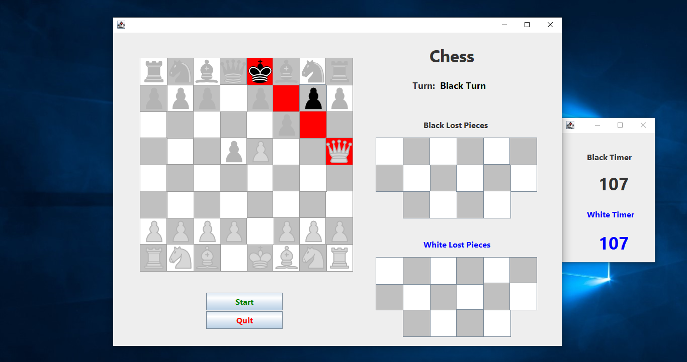

# &#9816; Chess Game
This is a chess game implemented in Java. The game features a graphical user interface (GUI) and allows players to compete in a standard chess match. The GUI is built using Java Swing.

## Getting started

This game runs smoothly with OpenJDK version 1.8.0_292.

1. **Clone the repository:** <br />
```
git clone https://github.com/sinaabbasi1/chess-game.git
```
2. **Compile the project:** If you're using the command line, navigate to the `src/` directory and compile the `.java` files: <br />
```
javac Frame.java
```
3. **Run the game:** <br />
```
java Frame
```

## Features
- **Graphical User Interface (GUI):** Built with Java Swing components to visualize the chessboard and pieces.
- **Timer Functionality:** A timer for each player is integrated to limit the duration of the game.
- **Interactive Gameplay:** Play chess against a friend in a local multiplayer setup.

## Screenshots

|  | 
|:--:| 
| *Startup Screen* |

|  | 
|:--:| 
| *Game Board* |

|  | 
|:--:| 
| *Piece Selection* |

|  | 
|:--:| 
| *Check Situation* |

|  | 
|:--:| 
| *Pawn Promotion* |

## Contributing

Feel free to submit issues or pull requests if you find bugs or want to improve the game.

## License

This project is open-source and available under the [MIT License](LICENSE).
